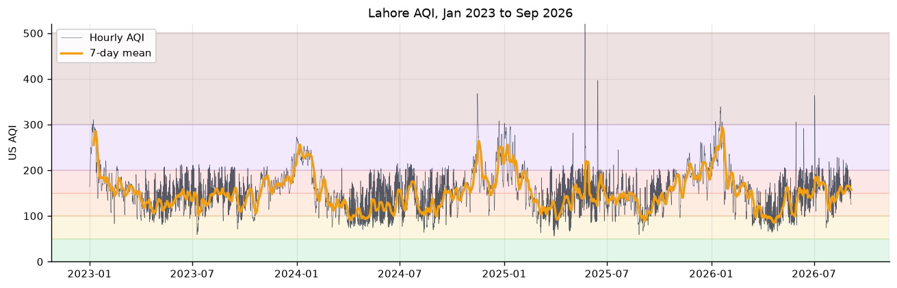
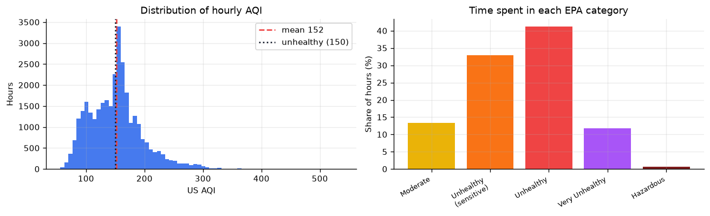
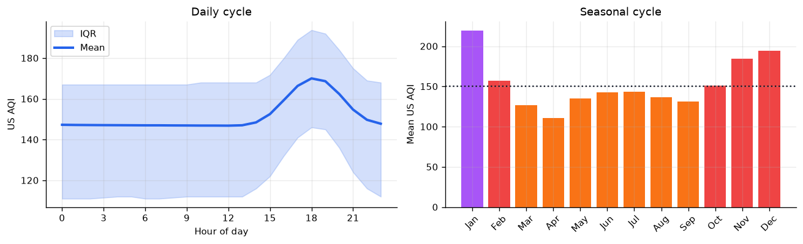
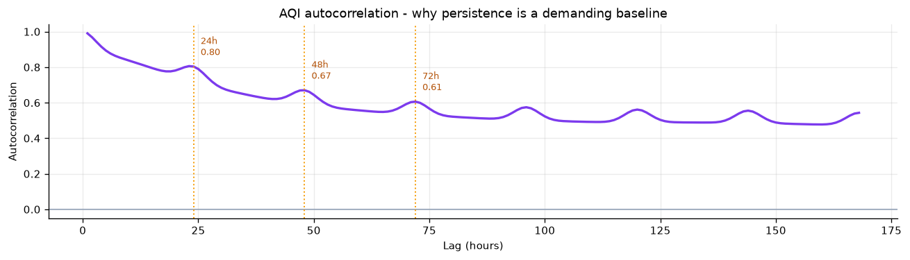
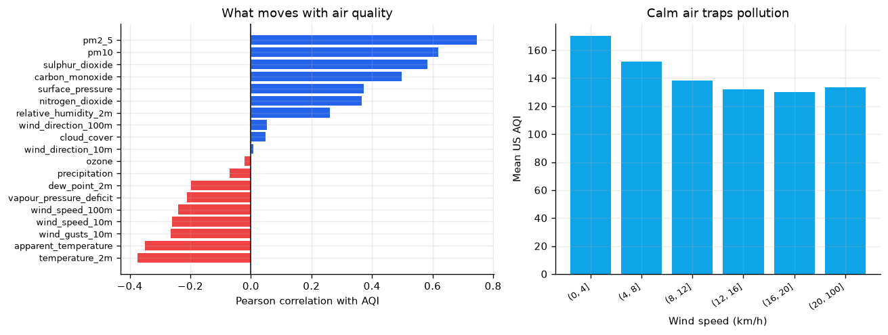
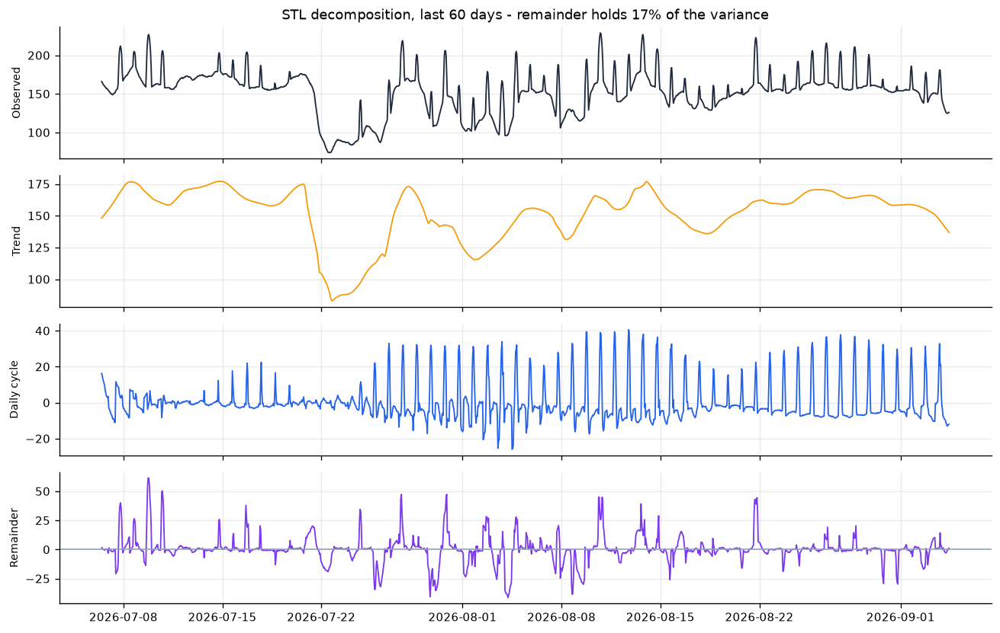
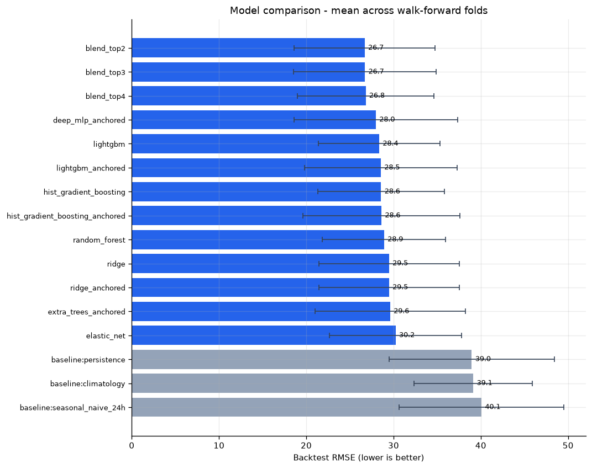
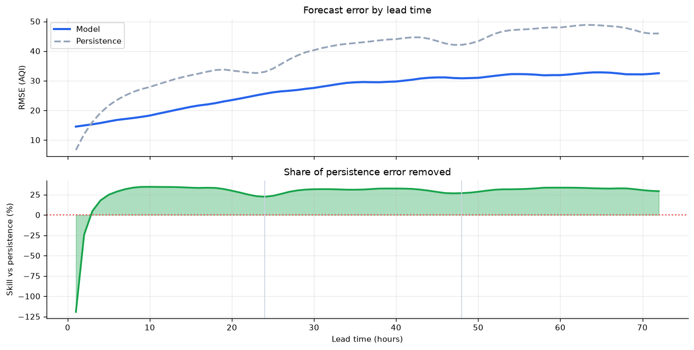
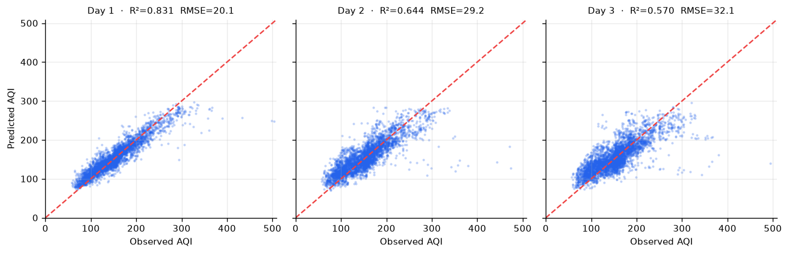
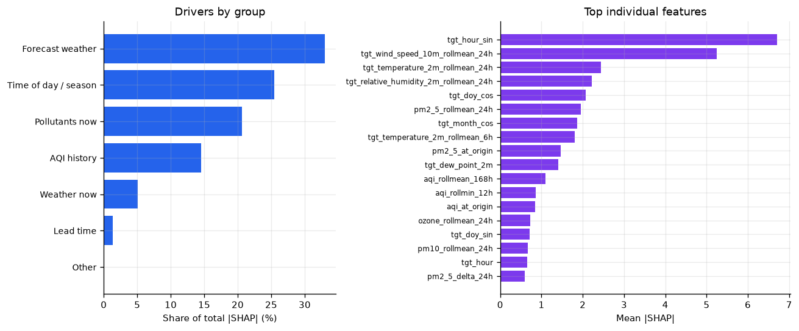

# Pearls AQI Predictor — Technical Report

**City:** Lahore (31.5497, 74.3436)
**Forecast horizon:** 3 days, hourly resolution (72 steps)
**Generated:** 2026-09-04 06:37 UTC
**Production model:** `blend_top2`

---

## Summary

An end-to-end system that forecasts the US Air Quality Index for Lahore
up to 3 days ahead, retrains itself daily, and serves
results through a REST API and an interactive dashboard.

The headline result: backtest RMSE of **26.69 AQI points**
with **R² = 0.651**, which is a **32.2% reduction in RMSE against a persistence forecast**. Accuracy is
reported per lead time rather than as a single average, because a 1-hour forecast
and a 72-hour forecast are different problems and averaging them together
flatters the harder one.

The model is trained on **32,219 hours** of real observations
(1342 days, 2023-01-01 to 2026-09-04) pulled from
Open-Meteo's reanalysis archive — not synthetic data, and not the ~90 days a
forecast endpoint alone would provide.

---

## 1. The data

| Property | Value |
|---|---|
| Source | Open-Meteo archive + air-quality API (free, no key) |
| Rows | 32,219 hourly observations |
| Span | 2023-01-01 00:00 → 2026-09-04 10:00 (1342 days) |
| Missing hours | 0 |
| Variables | 20 (weather, six pollutants, US AQI) |
| Mean AQI | 151.6 |
| Median AQI | 152.0 |
| Std. dev. | 46.7 |
| Range | 56 – 538 |
| 95th percentile | 236 |
| Hours ≥ 150 (Unhealthy) | 17,309 (53.7%) |

**Time spent in each EPA category**

| Category | Share of hours |
|---|---|
| Moderate | 13.3% |
| Unhealthy for Sensitive Groups | 33.0% |
| Unhealthy | 41.3% |
| Very Unhealthy | 11.7% |
| Hazardous | 0.7% |

### Two data decisions worth recording

**Why the history starts at 2023-01-01.** Open-Meteo's air-quality archive
accepts earlier dates and returns rows, but the `us_aqi` field comes back null
before 2023. The start date is the point where the target variable actually
exists, established empirically rather than assumed.

**Why `boundary_layer_height` is not a feature.** Mixing-layer depth is the
textbook meteorological driver of pollution build-up, and it was in the original
feature set. The archive endpoint answers `200 OK` for it and then returns a
column that is 99.5% null — only the most recent days carry values. A model
trained on that would fit a handful of recent rows and diverge in production. It
was replaced with the 10m/100m wind pair, which is populated across the entire
history; the shear between those levels carries much the same information about
vertical mixing. Every weather variable in the final set was checked for non-null
coverage on **both** the archive and forecast endpoints before being admitted.

### Stationarity

Augmented Dickey-Fuller, on the most recent year:

| Series | ADF statistic | p-value | Stationary at 5%? |
|---|---|---|---|
| AQI level | -4.83 | 0.0000 | yes |
| First difference | -19.38 | 0.0000 | yes |

Both series reject the unit-root null, so the level is already stationary over
this window and there is nothing for differencing to fix. That is a useful
negative result rather than a dull one: it predicts in advance that the anchored
model variants in section 3.1 — which reframe the target as a change from the
last observation, precisely the transform differencing performs — should gain
very little. Section 3.1 shows they gained very little. The diagnostic and the
backtest agree, which is more reassuring than either would be alone.

The caveat is that ADF tests the *mean* level, not the variance. Lahore's AQI
plainly has seasonal heteroscedasticity — winter is both higher and far more
volatile than summer — and a stationary mean does not make that go away.


*Full observation history with a 7-day rolling mean.*

*Hourly AQI distribution and time spent per EPA category.*

*Daily and seasonal cycles.*

*Autocorrelation out to one week.*

*Meteorological relationships.*

*STL decomposition into trend, daily cycle and remainder.*

---

## 2. Method

### 2.1 Direct multi-horizon forecasting

A 72-hour forecast can be produced two ways:

| | Recursive | Direct (used here) |
|---|---|---|
| Structure | Train 1-step, feed output back in, repeat 72× | Train `(state at t, horizon h) → aqi[t+h]` |
| Error behaviour | Compounds — step 72 sits on 71 previous errors | Independent per horizon |
| Exogenous inputs | Must be guessed forward | Real weather forecast used directly |
| Cost at inference | 72 sequential model calls | 1 batched call |

One model is trained across all 72 horizons with `h` as an input feature, so a
single fit covers the whole range while every prediction is made in one shot.

### 2.2 The leakage discipline

Every feature belongs to exactly one bucket:

- **ORIGIN** — computed from observations at or before the forecast origin `t`:
  lags, rolling statistics, backward-looking deltas, pollutant and weather state.
- **FUTURE** — weather and calendar at the *target* time `t+h`. Legitimate,
  because numerical weather prediction genuinely supplies these in advance and a
  calendar is known forever.
- **HORIZON** — the lead time itself.

Deliberately absent: any pollutant or AQI measurement at `t+h`. Open-Meteo
derives `us_aqi` from the pollutant concentrations, so a target-time PM2.5 column
would be the answer in different units.

This matters because the predecessor implementation of this project leaked
badly. It computed `aqi_change_rate = aqi.diff()` — that is `aqi[t] − aqi[t−1]` —
and passed it to the model alongside `aqi_lag_1h`, which is `aqi[t−1]`. Their sum
is exactly `aqi[t]`. The target was a linear combination of two inputs, so every
model scored R² ≈ 1.00 and every reported metric was meaningless. Nothing looked
wrong in the code; only the impossible score gave it away.

`tests/test_leakage.py` makes that class of bug non-silent. The central test
perturbs AQI values *after* a cutoff and asserts that the feature matrix for
earlier origins is bit-identical. Any feature reading the target at or beyond
prediction time fails it, regardless of how the leak is written.

### 2.3 Feature set

| Group | Examples | Count |
|---|---|---|
| AQI history | lags 1–72h, rolling mean/std/min/max over 3–168h, backward deltas, 24h z-score | ~40 |
| Pollutant state | PM2.5, PM10, CO, NO₂, SO₂, O₃ at origin plus lags and 24h momentum | ~40 |
| Weather at origin | temperature, humidity, wind u/v at 10m and 100m, shear, stagnation index, 24h precipitation | ~25 |
| Forecast weather at target | the same fields at `t+h`, plus 6h/24h trailing means over the forecast path | ~35 |
| Calendar at target | cyclical hour/month/day-of-year encodings, weekend flag | 11 |
| Lead time | `horizon_h`, `horizon_days` | 2 |

Wind direction is decomposed into u/v components rather than left in degrees,
where 359° and 1° are adjacent in reality but maximally distant numerically.

### 2.4 Validation

Walk-forward backtesting with expanding windows: train to a cutoff, score the
window that follows, roll the cutoff forward, repeat. This replays how the system
actually behaves in production, where it retrains daily and forecasts into
whatever comes next.

**The embargo.** Multi-horizon datasets leak across a naive split in a way that
is easy to miss. A training sample with origin `T − 10h` and horizon 72 has its
label at `T + 62h`. Splitting on origin alone puts that sample in training even
though its label lies inside the test window — fitting the model on the very
future it is about to be scored against. The split is therefore on `target_time`:

```
train = rows whose target_time <= cutoff
test  = rows whose origin      >  cutoff
```

which leaves a natural 72-hour embargo between them.

### 2.5 Baselines

A regression score is meaningless in isolation. Three references are scored on
identical test rows:

- **Persistence** — `ŷ(t+h) = aqi(t)`. Genuinely hard to beat at short lead times.
- **Seasonal naive** — same clock hour, most recent complete day.
- **Climatology** — historical mean for that (month, hour), fitted on training data only.

Skill is quoted against persistence, the strictest of the three.

---

## 3. Results

### 3.1 Model comparison

Mean across walk-forward folds; `±` is the standard deviation across folds, which shows how *dependably* a model achieves its average.

| model | rmse | rmse_std | mae | r2 | skill_vs_persistence | category_accuracy | n_folds |
|---|---|---|---|---|---|---|---|
| blend_top2 | 26.69 | 8.08 | 18.06 | 0.651 | 0.322 | 0.660 | 4 |
| blend_top3 | 26.72 | 8.16 | 17.93 | 0.649 | 0.321 | 0.666 | 4 |
| blend_top4 | 26.80 | 7.82 | 18.09 | 0.649 | 0.318 | 0.662 | 4 |
| deep_mlp_anchored | 27.97 | 9.38 | 18.96 | 0.612 | 0.293 | 0.655 | 4 |
| lightgbm | 28.36 | 6.96 | 19.33 | 0.615 | 0.272 | 0.641 | 4 |
| lightgbm_anchored | 28.54 | 8.76 | 18.77 | 0.601 | 0.275 | 0.660 | 4 |
| hist_gradient_boosting | 28.57 | 7.27 | 19.44 | 0.607 | 0.268 | 0.643 | 4 |
| hist_gradient_boosting_anchored | 28.61 | 8.97 | 18.88 | 0.599 | 0.274 | 0.657 | 4 |
| random_forest | 28.92 | 7.06 | 19.64 | 0.600 | 0.258 | 0.632 | 4 |
| ridge | 29.48 | 8.03 | 21.07 | 0.567 | 0.247 | 0.623 | 4 |
| ridge_anchored | 29.48 | 8.03 | 21.07 | 0.567 | 0.247 | 0.623 | 4 |
| extra_trees_anchored | 29.61 | 8.64 | 19.52 | 0.575 | 0.246 | 0.647 | 4 |
| elastic_net | 30.23 | 7.58 | 21.35 | 0.553 | 0.225 | 0.614 | 4 |
| baseline:persistence | 38.96 | 9.46 | 26.35 | 0.264 | — | 0.571 | 4 |
| baseline:climatology | 39.14 | 6.78 | 29.49 | 0.295 | — | 0.468 | 4 |
| baseline:seasonal_naive_24h | 40.07 | 9.47 | 27.28 | 0.239 | — | 0.548 | 4 |



**On the `blend_topK` rows.** These are equal-weighted averages of the
top-K individual candidates. They are close to free to evaluate — the backtest
already produced every model's predictions on the same test rows, so a blend is
an average of columns that already exist, with no refitting and no extra folds.
They are scored through the identical metric path as everything else, with
climatology refitted at each fold's cutoff, so they appear here on equal terms.

`blend_top2` reaches 26.69 RMSE against
`deep_mlp_anchored` at 27.97 — it beats the best single model by 1.28 RMSE. A blend is
promoted only when it wins outright; otherwise the best single model ships.

**A hypothesis the data would not settle.** Tree ensembles cannot
extrapolate beyond their training range, so predicting the *change* from the last
observed AQI (`y − aqi[t]`) rather than the level ought to help during severe
episodes, where the level leaves the range the model was trained on. Every
anchored variant was built and backtested alongside its level-target twin:

| Model | Level RMSE | Anchored RMSE | Difference |
|---|---|---|---|
| `hist_gradient_boosting` | 28.57 | 28.61 | -0.04 |
| `lightgbm` | 28.36 | 28.54 | -0.18 |
| `ridge` | 29.48 | 29.48 | -0.00 |

The result is a wash, and it points in different directions for different
models. Every gap above is an order of magnitude smaller than the fold-to-fold
standard deviation (median 8.03 RMSE), so the honest conclusion is that
this dataset does not decide the question — not that either framing wins. A
plausible reason the effect is so muted: `aqi_at_origin` is already a feature, so
a level-target model can learn the same residual relationship wherever it helps.

The exception is the neural network. `deep_mlp_anchored` is the best *single*
model in this run, and an MLP has none of a tree's built-in tolerance for a
shifting target level, so handing it a stationary target helps in a way it does
not for the ensembles. That is also the connection back to the ADF result in
section 1: the level is the non-stationary series, and the model that cares most
about stationarity is the one that gains most from removing it.

### 3.2 Accuracy by lead time

This is the number that matters. A single averaged R² hides the shape of the
problem; the degradation from day 1 to day 3 is the honest picture.

| Lead time | RMSE | MAE | R² | Correct EPA band | Skill vs persistence |
|---|---|---|---|---|---|
| Day 1 (1–24h) | 19.83 | 12.73 | 0.831 | 75.4% | +20.7% |
| Day 2 (25–48h) | 29.12 | 19.52 | 0.644 | 63.3% | +30.1% |
| Day 3 (49–72h) | 32.09 | 21.95 | 0.570 | 59.3% | +31.7% |




*Predicted against observed by forecast day. The spread widening from day 1 to day 3 is the same story the RMSE curve tells.*

### 3.3 Operational quality

Regression metrics do not describe what a user experiences. These do:

| Metric | Value | Meaning |
|---|---|---|
| Exact EPA band | 66.0% | forecast lands in the right category |
| Within one band | 99.2% | at most one category out |
| Exceedance recall | 80.5% | share of AQI ≥ 150 hours caught |
| Exceedance precision | 87.6% | share of alerts that were warranted |
| Base rate | 55.9% | how often AQI ≥ 150 actually occurs |

Recall is the figure to watch for an alerting system: a missed smog episode costs
far more than a false alarm.

---

## 4. What the model actually learned



**By driver group**

| Group | Share of total \|SHAP\| |
|---|---|
| Forecast weather | 33.0% |
| Time of day / season | 25.4% |
| Pollutants now | 20.6% |
| AQI history | 14.5% |
| Weather now | 5.0% |
| Lead time | 1.4% |
| Other | 0.1% |

**Top individual features**

| Feature | Mean \|SHAP\| |
|---|---|
| tgt_hour_sin | 6.700 |
| tgt_wind_speed_10m_rollmean_24h | 5.241 |
| tgt_temperature_2m_rollmean_24h | 2.440 |
| tgt_relative_humidity_2m_rollmean_24h | 2.224 |
| tgt_doy_cos | 2.071 |
| pm2_5_rollmean_24h | 1.957 |
| tgt_month_cos | 1.870 |
| tgt_temperature_2m_rollmean_6h | 1.809 |
| pm2_5_at_origin | 1.468 |
| tgt_dew_point_2m | 1.409 |
| aqi_rollmean_168h | 1.093 |
| aqi_rollmin_12h | 0.864 |

This is the single most important result in the report, and it validates the
central design decision.

**Forecast weather is the largest driver at 33%, ahead of AQI
history at 15%.** The model leans hardest on information about
the *target* hour — what the wind, temperature and rain will be doing when the
forecast lands — rather than on where AQI is right now.

That is precisely the information the recursive approach cannot use. A recursive
forecaster has to guess the weather forward, and in practice freezes it at the
last observed value; the direct formulation reads it straight from Open-Meteo's
published forecast. SHAP says that channel carries a third of the model's signal,
which is a concrete explanation for where the 33% skill over
persistence comes from: persistence has, by construction, none of it.

The corollary is the perfect-prog caveat in section 5. A model that depends this
heavily on forecast weather is exposed to weather-forecast error in live use in a
way the backtest does not measure.

---

## 5. Limitations

Stated plainly, because a report that only lists strengths is not a report.

**Perfect-prog training.** During training, the target-hour weather features come
from *observed* weather. At inference they come from a real forecast, which
carries its own error. This is the standard "perfect prog" setup in operational
meteorology, but it means live day-3 accuracy will be modestly worse than the
backtest suggests, since the backtest never had to cope with a wrong weather
forecast. Quantifying that gap would require archived forecast data, which
Open-Meteo's free tier does not expose.

**The target is itself modelled.** Open-Meteo's `us_aqi` derives from CAMS
reanalysis rather than from Lahore ground-station measurements. The system
forecasts a high-quality model product, not a sensor reading, and inherits
whatever bias CAMS carries in this region. Ground-truth validation against a
physical monitor is the obvious next step.

**One city, one location.** All results are for a single coordinate pair. Nothing
here demonstrates transfer to another city, and Lahore's pollution regime —
extreme winter inversions, agricultural burning — is unusual enough that the
learned relationships probably will not transfer unchanged.

**Analysis/forecast blending near the present.** The air-quality endpoint serves
forecast values for hours that have not closed yet. Those are now explicitly
dropped from the history and excluded when choosing the forecast origin — without
that guard the origin drifts days into the future and the model forecasts 72h
beyond a forecast. What remains is subtler and not fixed: CAMS publishes with a
lag, so the most recent few hours labelled as analysis may still be partly
model-derived. There is no field in the response that distinguishes them.

**Interval calibration is assumed, not measured.** The 80% bands come from
per-horizon backtest RMSE under a normal-error assumption. AQI errors are
right-skewed — big misses happen during episodes, not during clean air — so the
bands are likely too narrow in exactly the situations that matter most. Quantile
regression would fix this properly.

**A daily retrain on a growing window will drift.** Model selection happens
within each run, which is correct, but nothing currently detects a gradual
degradation in live accuracy. Logging predictions and scoring them once the truth
arrives would close that loop.

---

## 6. Reproducing this

```bash
pip install -r requirements.txt   # includes PyTorch (CPU) - see the note below

python -m src.backfill          # ~2023-01-01 → today of real observations
python -m src.train             # walk-forward backtest, select, promote
python -m src.report            # regenerate this document

uvicorn app.api:app --port 8000        # REST API + /docs
streamlit run app/streamlit_app.py     # dashboard
pytest -q                              # test suite, including the leakage guards
```

**On the PyTorch dependency.** It is required, not optional. The promoted model
is a blend containing the neural network, so loading `models/best_model.pkl`
imports `torch`; an install without it fails at load time. `requirements.txt`
pulls the CPU-only build (~200MB) — nothing here needs a GPU, and the MLP trains
on CPU in seconds. The registry records each model's load-time dependencies
under `requires`, so the failure explains itself if the environment is wrong.

Automation runs unattended in GitHub Actions: the feature pipeline hourly, the
training pipeline daily, and the test suite on every push.

*Every figure and number in this document was generated by `python -m src.report`
from the artefacts of the training run named above. Nothing was transcribed by
hand.*